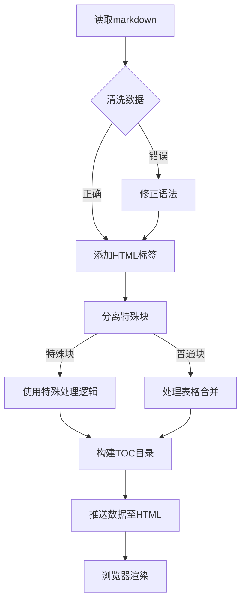
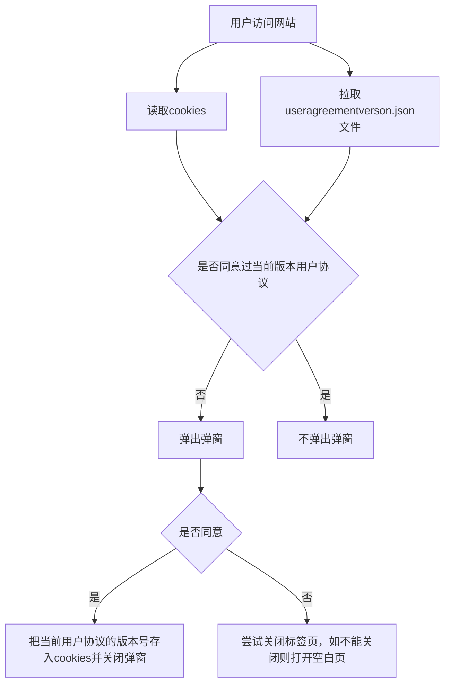
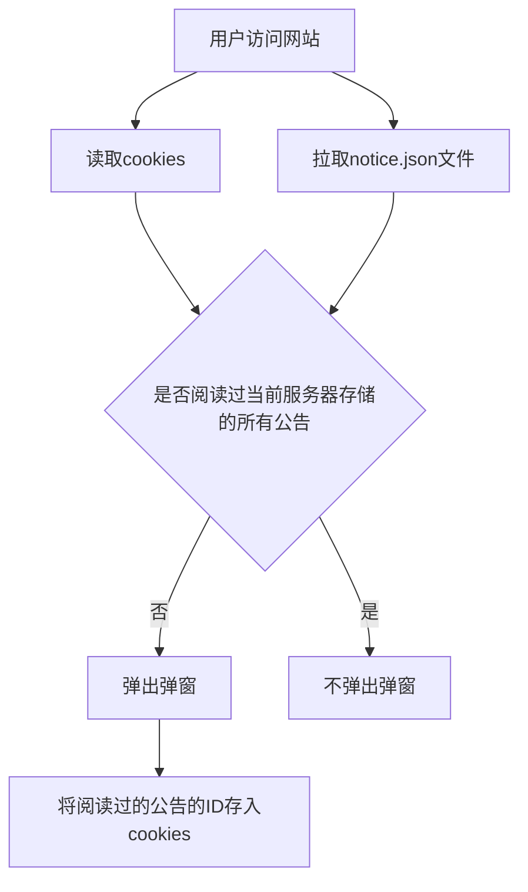

# 项目贡献说明

## 项目文件结构

```
GenshinLore/
│
├── basiclore/           # “基本设定”页面的子页面内容
│   ├── descenders/      # 降临者
│   │   └── base.html
│   ├── elementusage/    # 提瓦特常见元素力的使用者
│   │   └── base.html
│   ├── facilities/      # 大地及装置
│   │   └── base.html
│   ├── god/
│   │   └── base.html    # 魔神
│   ├── lightrelam/
│   │   └── base.html    # 龙/龙蜥/光界
│   ├── principles/
│   │   └── base.html    # 天理/人界
│   ├── stars/
│   │   └── base.html    # 星空
│   └── void/
│       └── base.html    # 深渊/虚界
├── docimg/
│   ├── icon.png         # 网站图标（白）
│   └── icondark.png     # 网站图标（黑）
├── fonts/               # 字体
│   ├── common.woff2     # Noto Sans SC（此文件仅作备用，目前已经修改为从Google的api加载子集化字体）
│   ├── genshin.woff2    # 汉仪文黑85W（原神默认字体）
│   └── Khaenriah.woff2  # 坎瑞亚风格字体
├── his/                 # 各国历史子页面
│   ├── Fontaine/        # 枫丹
│   │   ├── base.html    # 主页面
│   │   └── content.js   # 用于向主页面写入内容
│   ├── Inazuma/         # 稲妻
│   │   ├── base.html
│   │   └── content.js
│   ├── Khaenriah/       # 坎瑞亚
│   │   ├── base.html
│   │   └── content.js
│   ├── Liyue/           # 璃月
│   │   ├── base.html
│   │   └── content.js
│   ├── Mondstadt/       # 蒙德
│   │   ├── base.html
│   │   └── content.js
│   ├── Natlan/          # 纳塔
│   │   ├── base.html
│   │   └── content.js
│   ├── Snezhnaya/       # 至冬
│   │   ├── base.html
│   │   └── content.js
│   └── Sumeru/          # 须弥
│       ├── base.html
│       └── content.js
├── img/                 # 全站图片
│   ├── context/ (150 files)# 主段落内容插图；章首一、二级标题处的背景图
│   ├── country/ (14 files)# “各国历史”导航页图片
│   ├── logo/ (15 files) # 全站的图标，包括手册图标、favicon、“关于本站”页面的鸣谢图片、原神各国图标（已弃用）
│   └── others/ (4 files)# 404页面图片（虽然实际页面是内嵌的base64）、诗漱的头像等
├── Linear/              # “原神剧情线性观看顺序”页面
│   ├── base.html        # 主页面
│   └── marker.js        # 用于标记任务完成状态
├── md/                  # markdown源文件
│   ├── about.md         # “关于手册”页面
│   ├── aboutsite.md     # “关于本站”页面（不影响实际网页）
│   ├── Fontaine.md      # 枫丹页面
│   ├── Inazuma.md       # 稲妻页面
│   ├── Khaenriah.md     # 坎瑞亚页面
│   ├── Liyue.md         # 璃月页面
│   ├── main.md          # 主页部分鸣谢名单（不影响实际网页）
│   ├── Mondstadt.md     # 蒙德页面
│   ├── Natlan.md        # 纳塔页面
│   ├── preface.md       # 前言页面（不影响实际网页）
│   ├── Snezhnaya.md     # 至冬页面
│   ├── somewords.md     # 杂谈页面（不影响实际网页）
│   ├── Sumeru.md        # 须弥页面
│   └── Teyvathis.md     # 提瓦特历史页面
├── .gitignore           
├── 404.html             # 404页面
├── about.html           # “关于手册”页面
├── aboutcontent.js      # 用于向“关于手册”页面写入内容
├── aboutsite.html       # “关于本站”页面
├── basiclore.html       # “基本设定”导航页
├── BingSiteAuth.xml     
├── contentteyvat.js     # 用于向“提瓦特历史”页面写入内容
├── genshinbasichis.html # “时间线”页面
├── _headers             # 服务器请求头
├── history-country.html # “各国历史”导航页
├── index.html           # 开屏页
├── interestfacts.html   # 彩蛋页
├── interestfacts.json   # 彩蛋页数据
├── LICENCE.md
├── llms.txt           
├── main.html            # 主页
├── md.html              # markdown源文件提供页面
├── mermaid.min.js       # mermaid渲染器
├── notice.js            # 公告模块
├── notice.json          # 公告模块数据
├── preface.html         # 前言页面
├── README.md
├── robots.txt
├── script-index.js      # 开屏页脚本
├── script.js            # 全站脚本
├── sitemap.xml
├── somewords.html       # 杂谈页面
├── styles-index.css     # 开屏页样式
├── styles.css           # 全站样式
├── Teyvathis.html       # 提瓦特历史页面
├── useragreement.js     # 用户协议模块
├── useragreementversion.json# 用户协议模块数据
├── Via_7.0.0.zip        # 自用，借一下cloudflare服务器不过分吧
└── watermarkDiv.js      # “时间线”页面和“原神剧情线性观看顺序”页面水印模块
```

## 项目架构说明

### 技术栈

静态前端，HTML + CSS + JavaScript

### 实现方法

#### 纯静态页面

包括：`basiclore/`目录下的所有页面，`Linear/`目录下的所有页面，`404.html`,`aboutsite.html`，`basiclore.html`，`genshinbasichis.html`，`history-country.html`，`main.html`，`md.html`，`preface.html`，`somewords.html`

这些页面一般直接把内容写在HTML中；通过`styles.css`加载样式，有些页面还有内联样式（如`genshinbasichis.html`页面的表格是由excel导出的，保留了大量`xl` + 数字的样式）；通过`script.js`实现动态交互（如顶部页签的切换动画、右侧TOC目录跳转等）

#### 混合页面

包括：`index.html`和`about.html`

##### index.html

该页面通过`script-index.js`实现主要内容渲染和动态交互，如：

- 首屏粒子汇聚和消散动画（基于canvas）
- 背景视频播放
- 进入按钮的点击行为处理

尽管这些内容是基于JavaScript进行处理的，但它们仍属于不变的静态内容。

##### about.html

该页面通过`aboutcontent.js`实现主要内容渲染和动态交互，以及通过内联脚本实现彩蛋。但是，该页面开头的“版本修改记录”是硬编码的。

`aboutcontent.js`的实现方式与风格和`content.js`不相同，使用时注意不要把两者混淆。具体实现方式请通过文件类内注释查看。

#### 动态页面

包括：上述两条未提及的所有其他页面

这些页面通过`content.js`或`contentteyvat.js`实现主要内容渲染和动态交互。这些文件的实现方式类似，具体实现方式请通过文件内注释查看。

基本实现：



#### 用户协议模块和公告模块

##### 用户协议模块

该模块通过`useragreement.js`和`useragreementversion.json`实现。

- `useragreement.js`：负责存储用户协议Markdown内容，渲染弹窗，处理交互。
- `useragreementversion.json`：负责存储用户协议版本信息。

基本实现：



##### 公告模块

该模块通过`notice.js`和`notice.json`实现。

- `notice.js`：渲染弹窗，处理交互。
- `notice.json`：存储公告信息。

基本实现：

补充：notice.json文件结构

该文件由一个数组组成，在该数组中包含多个对象，每个对象就是一条公告，结构如下：（json原生并不支持注释，这里用//仅为表述方便）

```json
[
    {
        "title": "",                // 标题，字符串
        "description": "",          // 内容，字符串，不支持HTML标签
        "date": "",                 // 发布日期，必须是yyyy-mm-dd格式字符串
        "author": "",               // 作者，字符串
        "id": 10                    // 公告ID，整数，必须唯一，且不能为负数（发新公告时向后顺延即可，不要使用前面的数字！）
    },
]
```
## 文件编辑说明

1. 所有文件都是UTF-8编码。
2. 所有动态页面都是基于markdown进行渲染，markdown文件修改即生效，修改内容时无需修改HTML文件。
3. 所有制表符必须替换为四个空格。

## markdown格式说明

为方便不了解 HTML 的人编辑，本站的部分页面使用Markdown并动态解析。这些内容的编辑约定如下：

| Markdown 代码 | 说明 |
|----|----|
| `#` | 一级标题，页面最上方的大标题 |
| `##` | 二级标题，会在大纲里面显示 |
| `###` | 三级标题，会在大纲里面显示 |
| `####` | 四级标题，大纲里不显示 |
| `•` | 事件小标题 |
| `**文字**` | 红色文字 |
| `*文字*` | 加粗黑色文字 |
| `~文字~` | 带删除线文字 |
| `<sup>数字</sup>` | 注释角标 |
| `[文字](链接)` | 外部链接 |
| `> ` | 引用文字 |
| `> 数字 内容` | 注释详细内容，数字需与正文中的 `<sup></sup>` 对应。数字无需按顺序，只需对应即可，最终都会被渲染为*|
| `<br>` | 换行，表格中也可以使用 |
| ` <br />` | 表格中的空单元格（注意 `/` 前有一个空格），用于防止表格被合并|
|`\|表格内容\| `|表格|
|`\|\| `|表格空位，如果该位置是表头，且所有表头全为空白，则不会渲染；如果该位置是表格内部，则会以此位置向右和向下查找所有空白位置并合并这些单元格|
| `*******` | （七个`*`）分割线 |
| `` |图片，使用时需要将图片放在对应的目录中，每一个页面都有专门的图片目录，可直接复制该页面上已有的图片地址并将最后的文件名改成添加的图片。|
| `` |章首图，一般无需改动|
| ``内容`` |章首引入，一般无需改动|
| `` |章尾图，一般无需改动|
| `` |二级引文图，一般无需改动|
| `` \`\`\`  `` | 二级引文容器，用于添加二级引文（显示在二级引文图右侧），最好不要在中间加空行，该标签需要紧挨着`` |
| `:::`内容`:::` |“编者的话”部分，不用加编者的话四个字|
| `!!!`内容`!!!` |“参考资料”部分，不用加参考资料四个字|
| `<commoncontent>`内容`</commoncontent>` |普通内容，被这两个标签包裹的内容不会被渲染为时间线形式，而是普通文本形式，如“幕间：编者之声”部分|
|`` ```mermaid `` 内容 `` ``` ``|Mermaid图表，前端自动解析|
| `[Image](图片地址)` |图片标签，**已弃用**|
|`<postscript>`内容`</postscript>`|“关于手册”部分的“编者后记”部分标记|
|`<booklet>`内容`</booklet>`|“关于手册”部分的“随书附赠册”部分标记|
|`<special>`内容`</special>`|“关于手册”部分的第一部分彩蛋，这部分内容硬编码在HTML中，修改无效|
|`<end>`内容`</end>`|“关于手册”部分的第二部分彩蛋，这部分内容硬编码在HTML中，修改无效|

如有上表未涉及的内容，请参照实际网页的内容与markdown文件进行比对，推测该处的用法。

## AI使用说明

1. 严禁项目完全交给AI，所有AI生成的代码必须review，并写上详细的注释。

2. 严禁使用Trae CN IDE，该软件已经被发现向用户文件中注入水印（国际版尚未发现，但不建议使用，如需使用，建议使用 VS code 插件版）

## 协作说明

1. `main`分支是生产分支，修改后立刻同步至服务器，谨慎修改。

2. 所有的提交必须写中文commit message，风格参照之前的提交记录。